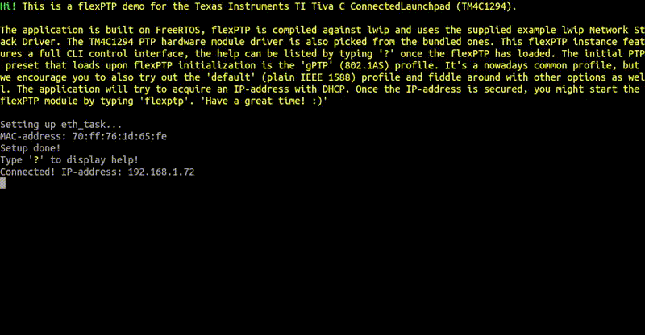

# EK-TM4C1294XL Connected LaunchPad flexPTP demo



## What's this?

> **This is a [flexPTP](https://github.com/epagris/flexPTP) demo project showcasing the capabilities of the flexPTP [IEEE 1588 Precision Time Protocol](https://ieeexplore.ieee.org/document/9120376) implementation for the [Texas Instruments EK-TM4C1294XL Connected LaunchPad](https://www.ti.com/tool/EK-TM4C1294XL) devboard.**

Still not clear what is it useful for? No worries, it's a behind-the-scenes support technology that use unaware every day if you have a smartphone or when you are connected to the internet. Modern telecommunication and measurement systems often rely on precise time synchronization down to the nanoseconds' scale. Methods got standardized by the IEEE and now it's known by the name of the Precision Time Protocol. This software project is an evaluation environment to showcase the capabilities of our IEEE 1588 PTP implementation named `flexPTP` on the Texas Instruments EK-TM4C1294XL Connected LaunchPad board.

> [!TIP]
>**Just want to try the demo and skip compiling? Download one of the precompiled binaries and jump to [Deploying](#deploying)!**


### Get the sources

> [!NOTE]
> To acquire the full source tree after cloning the repo, please fetch the linked *submodules* as well:

```
git clone https://gitea.epagris.com/epagris/flexPTP-demo-TM4C1294.git
cd flexPTP-demo-TM4C1294
git submodule init
git submodule update
```

## Building

### Prerequisites

The following two pieces of software are necessary for building:
- `arm-none-eabi-gcc` (v12+): the GCC ARM Cortex-M C cross-compiler
- `cmake` (v3.22+): KitWare's build management system

> [!NOTE]
> Both applications are available on common Linux systems through the official package repository. Although it's a Texas Instruments product, for building on Windows we recommend to install the STMicroelectronics [STM32CubeCLT](https://www.st.com/en/development-tools/stm32cubeclt.html) bundle shipping the `arm-none-eabi-{gcc|gdb}`, `openocd`. The [CMake](https://cmake.org/) needs to be installed separately.

### Compiling

The project is fully CMake managed. Configure and invoke the cross-compiler using the commands below:

```
cmake . -B build
cmake --build build --target flexptp-tiva --
```
Once the building has concluded the output binaries would be deposited in the `build` directory: `flexptp-tiva.elf`, `flexptp-tiva.bin`, `flexptp-tiva.hex`

## Deploying

### Downloading the firmware

The compiled binaries can be downloaded onto the devboard through several tools:

### Using the `lm4flash` utility

This tool is part of the open source [lm4flash](https://github.com/utzig/lm4tools) bundle, that is also available through common Linux package managers.

To program the MCU use the following command: `lm4flash build/flexptp-tiva.bin`

### Using the `openocd` application

The [OpenOCD](https://openocd.org/) programming/debugging tool can also be used to upload the firmware using the following command:

`openocd -f "board/ti_ek-tm4c1294xl.cfg" -c init -c halt -c "program build/flexptp-tiva.elf" -c exit`

OpenOCD is also available through the common Linux package managers.

### Interacting with the firmware

The firmware prints its messages to and expect user input coming on the board controller's virtual serial port using the `115200-8-N-1` configuration. Use [Putty](https://www.putty.org/) or any equivalent (e.g. GtkTerm) serial port terminal to communicate with the firmware. On Linux, the device will show up as `/dev/ttyACMx`.

> [!NOTE]
> Read the firmware's bootup hints and messages carefully!

### PPS signal

The 1PPS signal is emitted on the `PG0` pin.

## Development

An all-around [Visual Studio Code](https://code.visualstudio.com/) project is packaged along the project to enable easy development, debugging and editing. To enable these powerful features, [CMakeTools](https://marketplace.visualstudio.com/items?itemName=ms-vscode.cmake-tools), [Cortex-Debug](https://marketplace.visualstudio.com/items?itemName=marus25.cortex-debug), [Embedded Tools](https://marketplace.visualstudio.com/items?itemName=ms-vscode.vscode-embedded-tools) extensions and the [OpenOCD](https://openocd.org/) software package. [clangd](https://marketplace.visualstudio.com/items?itemName=llvm-vs-code-extensions.vscode-clangd) and clang-format are highly recommended.

Thas project has predefined *Launch* and *Attach* tasks.

### Software structure

The project is relying on the following large software building blocks:
- the [FreeRTOS](https://www.freertos.org/) embedded operating system,
- the [CMSIS RTOS V2](https://arm-software.github.io/CMSIS_6/latest/RTOS2/index.html) module as a wrapper for FreeRTOS,
- the [TivaWare](https://github.com/antoinealb/Tivaware) peripheral library,
- the [Lightweight IP](https://github.com/lwip-tcpip/lwip) (lwip) Ethernet stack extended with PTP timestamp support,
- the [embfmt](https://gitea.epagris.com/epagris/embfmt) a printf()-like formatted printer implementation for embedded systems.

The project is organized the following way:

```
ROOT
  Drivers
    CMSIS: ARM CMSIS-related files (CMSIS RTOS V2 and device headers)
    tivaware: TI's peripheral library (submodule)
  Inc: headers for compile-time library configuration
  Middlewares: FreeRTOS CMake configuration
  Modules
    flexptp: our PTP implementation (submodule)
    lwip: the LwIP Ethernet stack (submodule)
    lwip_port: network interface and system specific implementations
    embfmt: a printf()-like formatted printer implementation for embedded systems (submodule)
  Src
    utils: TI-provided utilities
    task_eth.c: Ethernet stack management

    cli.c/h: CLI-interface implementation
    cmds.c: custom CLI commands
```
> [!NOTE]
> The flexPTP parameters are defined in the [flexptp_options.h](Inc/flexptp_options.h) header.

> [!NOTE]
> The low-level Ethernet network driver is located in the [tiva-tm4c129.c](Modules/lwip_port/tiva-tm4c129/netif/tiva-tm4c129.c) file.

### Printing and logging

In this project the memory-heavy `printf()` is replaced by the more embedded-optimized `MSG()` function backed by the `embfmt` library. Parameters and format specifiers are fully `printf()` compatible.

### CLI commands

The software offers you with the following multitude, most flexPTP-related of commands:

```
?                                                  Print this help (22/48)
hist                                               Print command history
osinfo                                             Print OS-related information
flexptp                                            Start flexPTP daemon
ptp servo params [Kp Kd]                           Set or query K_p and K_d servo parameters
ptp servo log internals {on|off}                   Enable or disable logging of servo internals
ptp reset                                          Reset PTP subsystem
ptp servo offset [offset_ns]                       Set or query clock offset
ptp log {def|corr|ts|info|locked|bmca} {on|off}    Turn on or off logging
time [ns]                                          Print time
ptp master [[un]prefer] [clockid]                  Master clock settings
ptp info                                           Print PTP info
ptp domain [domain]                                Print or get PTP domain
ptp addend [addend]                                Print or set addend
ptp transport [{ipv4|802.3}]                       Set or get PTP transport layer
ptp delmech [{e2e|p2p}]                            Set or get PTP delay mechanism
ptp transpec [{def|gPTP}]                          Set or get PTP transportSpecific field (majorSdoId)
ptp profile [preset [<name>]]                      Print or set PTP profile, or list available presets
ptp tlv [preset [name]|unload]                     Print or set TLV-chain, or list available TLV presets
ptp pflags [<flags>]                               Print or set profile flags
ptp period <delreq|sync|ann> [<lp>|matched]        Print or set log. periods
ptp coarse [threshold]                             Print or set coarse correction threshold
ptp priority [<p1> <p2>]                           Print or set clock priority fields
```

> [!TIP]
> The above hint can be listed by typing '?'.

## Related papers and references

[Time Synchronization Extension for the IO-Link Industrial Communication Protocol](https://ieeexplore.ieee.org/document/10747727)

[Distributed Measurement System for Performance Evaluation of Embedded Clock Synchronization Solutions](https://ieeexplore.ieee.org/document/9805958/)

[Portable, PTP-based Clock Synchronization Implementation for Microcontroller-based Systems and its Performance Evaluation](https://ieeexplore.ieee.org/document/9615250)

[Synchronization of Sampling in a Distributed Audio Frequency Range Data Acquisition System Utilizing Microcontrollers](https://ieeexplore.ieee.org/document/9918455/)

[Methods of Peripheral Synchronization in Real-Time Cyber-Physical Systems](https://ieeexplore.ieee.org/document/10178979/)


## License

The project is created by András Wiesner (Epagris) in 2025 and published under the MIT license. Contributions are welcome! :)


